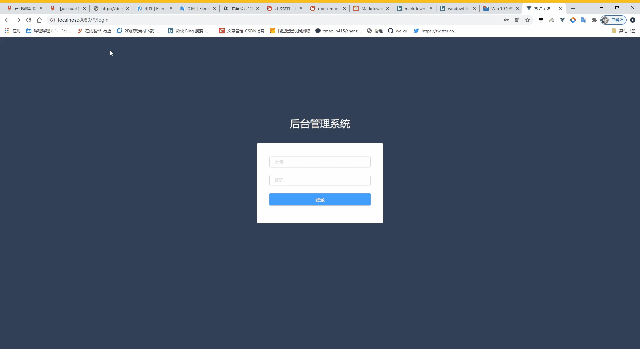
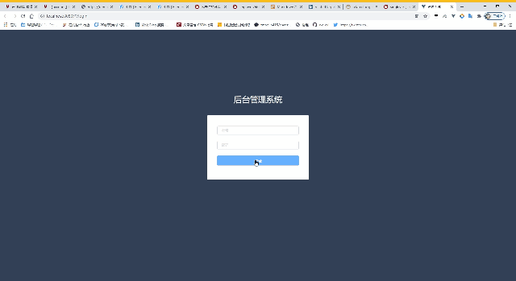
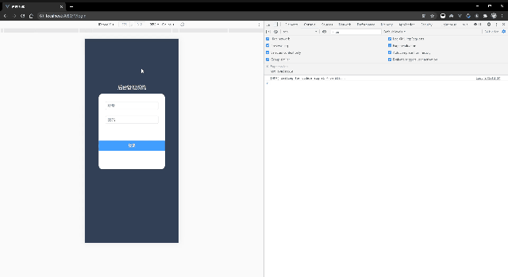

# 这是一个通用管理系统模板
### 图片展示
#### 登陆界面展示

#### 内部页面样式展示

#### 移动端页面展示

### 技术
1. vue
2. vuex
3. vue-router
4. axios
5. element-ui
### 安装&运行
download该项目后，根目录下，`npm install` 即可

输入`npm run serve`后运行该项目

### 新增页面
创建组件后，在路由文件夹 route 下 index.js 文件中 `routes`中 `meta`为 `start`的对象中的`children` 数组中引入 

vue-router基本配置 [官方网址](https://router.vuejs.org/zh/guide/essentials/dynamic-matching.html)

children数组中的配置项
|key|数据类型|描述|
|-|-|-|
|meta|String|该页面的标签，导航栏的标签|
|icon|String|icon所绑定的class，可使用elementUI的icon的class|

例如：
```
        {
            meta:'start',
            path:'/',
            component:re => require(['../components/main/common/Home.vue'],re),
            children:[
                {
                    path:'/main',
                    component:re => require(['../components/First.vue'],re),
                    meta:'首页',
                    icon:'el-icon-switch-button'
                },
            ]
        }
```
#### 二级标签在需要加入二级标签的标签中设置children，在children中相同配置

* !注意目前仅最多支持二级标签 *

例如：
```
        {
            meta:'start',
            path:'/',
            component:re => require(['../components/main/common/Home.vue'],re),
            children:[
                {
                    meta:'功能1',
                    icon:'el-icon-money',
                    path:'/tax_manage',
                    component:re => require(['../components/Tax_manage.vue'],re),
                    children:[
                        {
                            meta:'二级标签',
                            icon:'el-icon-coin',
                            path:'/tax_compute',
                            component:re => require(['../components/tax_compute.vue'],re),
                        }
                    ]
                },
            ]
        }
```
### 组件功能
1. 该项目安装 [element-ui](https://element.eleme.cn/#/zh-CN/component/installation)
2. 移动端使用的dialog（弹窗）`this.$dialog(option)`

option对象配置
|key|数据类型|描述|默认值|
|-|-|-|
|show|Boolean|token作为登录验证和页面刷新验证|true|
|title|String|标题|标题|
|message|String|提示内容|内容|
|type|Boolean|`false`为confirm类型提示，`true`为alert类型提示|内容|
|success|function|用户点击确认后执行的函数||
|cancel|function|用户点击取消后执行的函数||
### 初始配置
在vuex文件 src/store/index.js 下中的 state
|key|数据类型|描述|
|-|-|-|
|token|String|token作为登录验证和页面刷新验证|
|defineNowPath|String|基础路由，所有页面删除后，会更具该路由匹配页面|
|nowPath|String|当前页面所在的路由，可用于配置初始路由|
